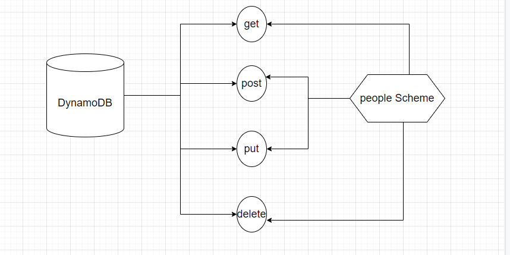

# serverless-api

- **What is the root URL to your API?**
 
    **Root Link :**   [https://952sh96wr3.execute-api.us-east-1.amazonaws.com](https://952sh96wr3.execute-api.us-east-1.amazonaws.com)

- **What are the routes?**

    - **route get** [https://952sh96wr3.execute-api.us-east-1.amazonaws.com/people]( https://952sh96wr3.execute-api.us-east-1.amazonaws.com/people)

    - **route get with id**  [https://952sh96wr3.execute-api.us-east-1.amazonaws.com/people/{id}](https://952sh96wr3.execute-api.us-east-1.amazonaws.com/people/{id})

    - **route Post** [https://952sh96wr3.execute-api.us-east-1.amazonaws.com/people](https://952sh96wr3.execute-api.us-east-1.amazonaws.com/people)

    - **route put** [https://952sh96wr3.execute-api.us-east-1.amazonaws.com/people/{id}](https://952sh96wr3.execute-api.us-east-1.amazonaws.com/people/{id})

    - **route Delete** [https://952sh96wr3.execute-api.us-east-1.amazonaws.com/people/{id}](https://952sh96wr3.execute-api.us-east-1.amazonaws.com/people/{id})

- **What inputs do they require?**

    - **route get** *Nothing*

   - **route get with id** *require id*

   - **route Post** *require body*

   - **route put** *require body*

   - **route Delete** *require id*

- **What output do they return?**

    - **route get** *array with all object*

   - **route get with id** *one object that matching with id*

   - **route Post** *add new obeject*

   - **route put** *update the object that match with id*

   - **route Delete** *retutn emty object*

  ## pul Request Link: 

   **UML** 

   

